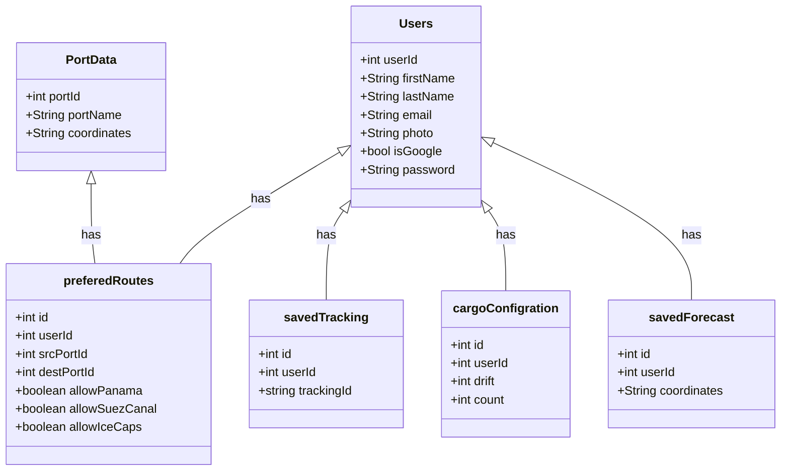

Topic: Oceans and the Law of the Sea
--------------------------------------

Project Name: Aqua Paths(Google Maps for sea Routes)
-------------------------

Video Walkthrough Link: https://drive.google.com/file/d/1Tn5eccLXaq8uGyB_ra0NsIYahStX0QIR/view?usp=sharing
-------------------------

Project Description 
-------------------

The Application is designed to identify the most efficient routes between sea ports, allowing users to customize various parameters. It also delivers up to seven days of weather forecasts for fishermen at their chosen coordinates. Furthermore, users can easily track their cargo shipments. The dashboard provides the latest news on marine life and offers valuable insights into NGOs dedicated to ocean cleanup efforts.

# Object model

